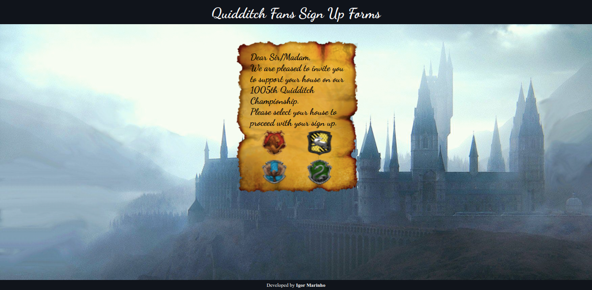

# Quidditch Fans Registration Form Project

  

  
  
  
    
   
   

  
<h2>:brazil: Português</h2>

  Esse projeto foi inspirado no projeto que fiz enquanto estudando Fundamentos de Desenvolvimento Web no curso da Trybe para fins educacionais. 
   O desenvolvimento desse projeto se deu no modelo Pair Programming com o amigo <a href="https://github.com/Felpsmars" target="_blank">Luiz Felipe Martins</a>, depois eu refatorei a estilização e adicionei algumas funcionalidades.
 
 Como na época eu ainda não tinha conhecimento sobre rotas ou maneiras de envio de informações, o formulário não envia as informações obtidas, contudo, mostra habilidades em construção de formulários além de possibilitar a implementação de alguns Easter Eggs para fãs de Harry Potter.
 
 Pontos Interessantes:
 * Mudança de stylo de background em função de preenchimento do formulário;
 * Easter eggs no site;
 * Design responsivo.
  
  ## Live Link
  <a href="https://quidditch-form.netlify.app/">Formulário de inscrição para torcida do torneio de Quadribol</a>
  
  ## Screenshot
  
  
  ## Objetivos
  * Criar uma aplicação web de formulário;
  * Tornar a aplicação responsiva;
  * Possuir diferentes tipos de inputs(radio, select, checkbox, text area, text);
  * Usar algumas Regex.
  
  ## Tecnologias usadas
  * HTML
  * CSS
  * Javacript
  * DOM
  * Semantic HTML
  
  ## Como usar
  Acesse a página, se envolva na experiência de preencher o formulário para ser parte da torcida do torneio de Quadribol.  
  Dicas:  
  Tente se cadastrar como estudante de diferentes casas;  
  Tente se cadastrar como personagens famosos do universo Harry Potter  para ver diferentes intereções( ex.: Hermione Granger, ...).  
    
  ## Rodar Localmente
  ### Requisitos:
   * Google Chrome
   * VS Code (com a extensão Live Server)
    
  ### Clonar no seu computador (via SSH)
  No terminal:
  
    git clone git@github.com:IgorMarinhoArgollo/quidditch-signup.git
  

  ### Iniciando o projeto localmente
  Abra o projeto com o VS code e rode o projeto com a extensão Live Server
   
  Disclaimer: 
   
     Todos os links e fontes das imagens estão presentes no arquivo HTML.
  
  ## Informações de Desenvolvimento (Projeto Original)
  Commits de Desenvolvimento: 16;  
  Tempo Gasto: 2 dias;

##
This project was inspired on a project I did while studying Fundamentals of Web Development in the Trybe course for educational purposes.  The project I did during the course was done in pair programming with a friend <a href="https://github.com/Felpsmars" target="_blank">Luiz Felipe Martins</a> later I refactored the code to style it and add some functionalities.
 
 As at that time I didn't know yet how to create routes or post it anywhere, this form does not send the information anywhere but it shows that I know how to build forms.
 
 Interesting points:
 * Change of style (background) depending on forms filling;
 * Easter eggs on the app;
 * Responsive design.

## Live Link
<a href="https://quidditch-form.netlify.app/" target="_blank">Quidditch Fan Registration Form</a>
  
## Screenshot

## My Goals
* Create a form App;
* Make it Responsive;
* Have different types of inputs(radio, select, checkbox, text area, text);
* Use some Regex.

## Used Technologies
  * HTML
  * CSS
  * Javacript
  * DOM
  * Semantic HTML

## How to use it
  Just go to the page, get imerse on the experience of sign up for be part of the fans on a Quidditch Championship.  
  Tips:  
  Try to sign up as students from differents houses;  
  Try to sign up as kwnon characters to see different interactions ( ex.: Hermione Granger, ...).  
    
## Run Locally
  ### Requirements:
   * Google Chrome
   * VS Code (with Live Server extension)
    
  ### Cloning into your computer (via SSH)
  On terminal:

      git clone git@github.com:IgorMarinhoArgollo/quidditch-signup.git

  ### Starting project locally
  Open the project with VS Code and run it with the Live Server Extension.

  Disclaimer: 
   
     All of the links and fonts are presented on the HTML file.
    
    
## Development Information (Original Project)
  Development Commits: 16;  
  Time Spent: 2 days;   
